# Diagram Podróży Użytkownika - AstroRunner

## Analiza Podróży Użytkownika

<user_journey_analysis>

### 1. Ścieżki użytkownika wymienione w plikach referencyjnych

**Z PRD (Product Requirements Document):**
- US-001: Rejestracja nowego użytkownika
- US-002: Bezpieczne logowanie
- US-003: Resetowanie hasła
- US-004-008: Zarządzanie aktywnościami (CRUD)

**Z Auth Spec:**
- Nowy użytkownik: / → /login → /signup → /activities
- Istniejący użytkownik: / → /login → /activities
- Wylogowanie: /activities → logout → /login
- Resetowanie hasła: /login → /password-reset → email → reset → /login
- Zarządzanie profilem: /activities → /profile → /activities

### 2. Główne podróże i odpowiadające stany

**Podróż 1: Nowy Użytkownik (Rejestracja)**
- Stan początkowy: Niezalogowany
- Strona główna → Przekierowanie do logowania
- Kliknięcie "Utwórz konto" → Formularz rejestracji
- Wypełnienie danych → Walidacja
- Sukces → Konto utworzone → Zalogowany
- Dostęp do aplikacji

**Podróż 2: Istniejący Użytkownik (Logowanie)**
- Stan początkowy: Niezalogowany
- Strona główna → Przekierowanie do logowania
- Wprowadzenie danych → Walidacja
- Sukces → Zalogowany → Dostęp do aplikacji

**Podróż 3: Odzyskiwanie Hasła**
- Stan: Niezalogowany, zapomniał hasła
- Strona logowania → Link "Zapomniałeś hasła?"
- Formularz resetowania → Wysłanie emaila
- Użytkownik sprawdza email → Kliknięcie linku
- Zewnętrzna strona Supabase → Ustawienie nowego hasła
- Powrót do logowania → Zalogowanie z nowym hasłem

**Podróż 4: Zarządzanie Aktywnościami (Core Loop)**
- Stan: Zalogowany
- Przeglądanie listy aktywności
- Dodawanie nowej aktywności
- Edycja istniejącej aktywności
- Usuwanie aktywności (z potwierdzeniem)
- Filtrowanie po miesiącu

**Podróż 5: Zarządzanie Profilem**
- Stan: Zalogowany
- Menu użytkownika → Profile
- Zmiana preferencji (jednostka dystansu)
- Zapisanie → Powrót do aktywności

**Podróż 6: Wylogowanie**
- Stan: Zalogowany
- Menu użytkownika → Logout
- Wylogowanie → Przekierowanie do logowania

### 3. Punkty decyzyjne i alternatywne ścieżki

**Punkt decyzyjny 1: Czy użytkownik jest zalogowany?**
- TAK → Przekieruj do /activities
- NIE → Przekieruj do /login

**Punkt decyzyjny 2: Czy dane logowania są poprawne?**
- TAK → Zaloguj i przekieruj do /activities
- NIE → Pokaż błąd i pozostań na /login

**Punkt decyzyjny 3: Czy hasło spełnia wymagania?**
- TAK → Pozwól na rejestrację
- NIE → Pokaż feedback siły hasła

**Punkt decyzyjny 4: Czy email już istnieje?**
- TAK → Błąd "Email już używany"
- NIE → Utwórz konto

**Punkt decyzyjny 5: Czy użytkownik potwierdza usunięcie?**
- TAK → Usuń aktywność
- NIE → Anuluj, powrót do listy

**Punkt decyzyjny 6: Czy token resetowania jest ważny?**
- TAK → Pozwól na ustawienie nowego hasła
- NIE → Pokaż błąd "Token wygasł"

### 4. Opis celu każdego stanu

**Niezalogowany:**
- Cel: Umożliwić użytkownikowi zalogowanie się lub utworzenie konta
- Dostępne akcje: Logowanie, Rejestracja, Resetowanie hasła

**StronaLogowania:**
- Cel: Zebranie danych logowania (email, hasło)
- Dostępne akcje: Wprowadzenie danych, Kliknięcie "Zaloguj", Link do rejestracji, Link do resetowania

**StronaRejestracji:**
- Cel: Utworzenie nowego konta użytkownika
- Dostępne akcje: Wprowadzenie email/hasła, Wizualizacja siły hasła, Kliknięcie "Zarejestruj"

**ResetowanieHasla:**
- Cel: Inicjacja procesu odzyskiwania hasła
- Dostępne akcje: Wprowadzenie emaila, Kliknięcie "Wyślij link"

**Zalogowany:**
- Cel: Dostęp do głównej funkcjonalności aplikacji
- Dostępne akcje: Zarządzanie aktywnościami, Zarządzanie profilem, Wylogowanie

**ListaAktywnosci:**
- Cel: Przeglądanie historii aktywności
- Dostępne akcje: Dodawanie, Edycja, Usuwanie, Filtrowanie, Nawigacja po miesiącach

**DodawanieAktywnosci:**
- Cel: Rejestracja nowej aktywności
- Dostępne akcje: Wypełnienie formularza (data, czas, typ, dystans opcjonalny), Zapisanie

**EdycjaAktywnosci:**
- Cel: Korekta danych istniejącej aktywności
- Dostępne akcje: Modyfikacja pól, Zapisanie zmian

**UsuwanieAktywnosci:**
- Cel: Potwierdzenie i wykonanie usunięcia
- Dostępne akcje: Potwierdzenie "Tak/Nie"

**ZarzadzanieProfilem:**
- Cel: Zmiana preferencji użytkownika
- Dostępne akcje: Zmiana jednostki dystansu (km/mi), Zapisanie

</user_journey_analysis>

## Diagram Mermaid

```mermaid
stateDiagram-v2
    [*] --> StronaGlowna

    state "Sprawdzenie Autentykacji" as SprawdzenieAuth
    StronaGlowna --> SprawdzenieAuth

    state if_zalogowany <<choice>>
    SprawdzenieAuth --> if_zalogowany
    if_zalogowany --> StronaLogowania: Niezalogowany
    if_zalogowany --> ListaAktywnosci: Zalogowany

    state "Proces Autentykacji" as ProcesAuth {
        state "Strona Logowania" as StronaLogowania {
            [*] --> FormularzLogowania
            FormularzLogowania --> WalidacjaLogowania

            state if_dane_poprawne <<choice>>
            WalidacjaLogowania --> if_dane_poprawne
            if_dane_poprawne --> BladLogowania: Dane niepoprawne
            if_dane_poprawne --> SukcessLogowania: Dane poprawne
            BladLogowania --> FormularzLogowania
        }

        state "Rejestracja Nowego Konta" as ProcesRejestracji {
            [*] --> FormularzRejestracji
            FormularzRejestracji --> WalidacjaHasla
            note right of WalidacjaHasla
                Wizualizacja siły hasła
                min 8 znaków, wielka/mała litera, cyfra
            end note

            state if_haslo_silne <<choice>>
            WalidacjaHasla --> if_haslo_silne
            if_haslo_silne --> SlabeHaslo: Hasło za słabe
            if_haslo_silne --> SprawdzEmaila: Hasło OK
            SlabeHaslo --> FormularzRejestracji

            state if_email_unikatowy <<choice>>
            SprawdzEmaila --> if_email_unikatowy
            if_email_unikatowy --> EmailIstnieje: Email zajęty
            if_email_unikatowy --> TworzenieKonta: Email dostępny
            EmailIstnieje --> FormularzRejestracji

            TworzenieKonta --> TworzenieProfileu
            TworzenieProfileu --> SukcessRejestracji
        }

        state "Resetowanie Hasła" as ProcesResetowania {
            [*] --> FormularzResetowania
            FormularzResetowania --> WyslanieEmaila
            WyslanieEmaila --> KomunikatWyslano
            note right of KomunikatWyslano
                Generyczny komunikat sukcesu
                bez ujawniania czy email istnieje
            end note
            KomunikatWyslano --> CzekaNaEmail

            state "Użytkownik sprawdza email" as CzekaNaEmail
            CzekaNaEmail --> KlikniecieLinkuReset

            state "Strona Supabase" as StronaSupabase {
                KlikniecieLinkuReset --> WeryfikacjaTokenu

                state if_token_wazny <<choice>>
                WeryfikacjaTokenu --> if_token_wazny
                if_token_wazny --> TokenNiewazny: Token wygasł
                if_token_wazny --> UstawianieNowegoHasla: Token OK

                UstawianieNowegoHasla --> HasloZmienione
            }

            HasloZmienione --> PowrotDoLogowania
        }

        FormularzLogowania --> ProcesRejestracji: Kliknij Utwórz konto
        FormularzRejestracji --> FormularzLogowania: Kliknij Mam już konto
        FormularzLogowania --> ProcesResetowania: Kliknij Zapomniałeś hasła
        PowrotDoLogowania --> FormularzLogowania
        TokenNiewazny --> FormularzLogowania
    }

    SukcessLogowania --> ListaAktywnosci
    SukcessRejestracji --> ListaAktywnosci

    state "Główna Funkcjonalność Aplikacji" as AplikacjaGlowna {
        state "Lista Aktywności" as ListaAktywnosci {
            [*] --> PrzegladanieAktywnosci
            PrzegladanieAktywnosci --> FiltrowaniePoMiesiacu
            PrzegladanieAktywnosci --> DodawanieAktywnosci
            PrzegladanieAktywnosci --> EdycjaAktywnosci
            PrzegladanieAktywnosci --> UsuwanieAktywnosci
            FiltrowaniePoMiesiacu --> PrzegladanieAktywnosci

            note right of PrzegladanieAktywnosci
                Wyświetlanie historii
                posortowane po dacie
            end note
        }

        state "Dodawanie Nowej Aktywności" as DodawanieAktywnosci {
            [*] --> OtwarcieFormularza
            OtwarcieFormularza --> WypelnienieFormularza
            note right of WypelnienieFormularza
                Pola: Data, Czas trwania, Typ, Dystans opcjonalny
            end note
            WypelnienieFormularza --> WalidacjaDanych

            state if_dane_valid <<choice>>
            WalidacjaDanych --> if_dane_valid
            if_dane_valid --> BladWalidacji: Błędne dane
            if_dane_valid --> ZapisanieAktywnosci: Dane poprawne
            BladWalidacji --> WypelnienieFormularza
            ZapisanieAktywnosci --> AktywnoscDodana
        }

        state "Edycja Istniejącej Aktywności" as EdycjaAktywnosci {
            [*] --> ZaladowanieFormularza
            ZaladowanieFormularza --> ModyfikacjaDanych
            ModyfikacjaDanych --> WalidacjaEdycji

            state if_edycja_valid <<choice>>
            WalidacjaEdycji --> if_edycja_valid
            if_edycja_valid --> BladEdycji: Błędne dane
            if_edycja_valid --> ZapisanieZmian: Dane poprawne
            BladEdycji --> ModyfikacjaDanych
            ZapisanieZmian --> AktywnoscZaktualizowana
        }

        state "Usuwanie Aktywności" as UsuwanieAktywnosci {
            [*] --> PotwierdzanieUsuniecia
            note right of PotwierdzanieUsuniecia
                Dialog: Czy na pewno chcesz usunąć?
            end note

            state if_potwierdzone <<choice>>
            PotwierdzanieUsuniecia --> if_potwierdzone
            if_potwierdzone --> AnulowanieUsuniecia: Nie
            if_potwierdzone --> WykonanieUsuniecia: Tak
            WykonanieUsuniecia --> AktywnoscUsunieta
        }

        state "Zarządzanie Profilem" as ZarzadzanieProfilem {
            [*] --> StronaProfileu
            StronaProfileu --> EdycjaPreferencji
            note right of EdycjaPreferencji
                Zmiana jednostki dystansu km/mi
            end note
            EdycjaPreferencji --> ZapisanieProfileu
            ZapisanieProfileu --> ProfilZaktualizowany
        }

        AktywnoscDodana --> PrzegladanieAktywnosci
        AktywnoscZaktualizowana --> PrzegladanieAktywnosci
        AktywnoscUsunieta --> PrzegladanieAktywnosci
        AnulowanieUsuniecia --> PrzegladanieAktywnosci
        ProfilZaktualizowany --> PrzegladanieAktywnosci

        PrzegladanieAktywnosci --> ZarzadzanieProfilem: Menu użytkownika > Profile
        PrzegladanieAktywnosci --> Wylogowanie: Menu użytkownika > Logout
    }

    state "Proces Wylogowania" as Wylogowanie {
        [*] --> WywolanieWylogowania
        WywolanieWylogowania --> WyczyszczenieeSesji
        WyczyszczenieeSesji --> UzytkownikWylogowany
    }

    UzytkownikWylogowany --> StronaLogowania

    StronaLogowania --> [*]: Zamknięcie aplikacji
    ListaAktywnosci --> [*]: Zamknięcie aplikacji
```

## Opis Podróży Użytkownika

### Scenariusze Biznesowe

#### Scenariusz 1: Nowy Użytkownik (US-001)
**Cel:** Szybka rejestracja i rozpoczęcie śledzenia aktywności

**Kroki:**
1. Użytkownik wchodzi na stronę główną
2. System przekierowuje do /login (niezalogowany)
3. Użytkownik klika "Utwórz konto"
4. Wypełnia formularz rejestracji (email, hasło)
5. System pokazuje wskaźnik siły hasła w czasie rzeczywistym
6. Jeśli hasło słabe → Feedback i wymagania
7. Jeśli email zajęty → Komunikat błędu
8. Po poprawnej walidacji → Konto utworzone
9. Automatyczne zalogowanie i przekierowanie do /activities
10. Użytkownik może natychmiast dodać pierwszą aktywność

**Punkty decyzyjne:**
- Czy hasło spełnia wymagania? (min 8 znaków, wielka/mała, cyfra)
- Czy email jest unikatowy?

#### Scenariusz 2: Istniejący Użytkownik (US-002)
**Cel:** Bezpieczne zalogowanie i dostęp do danych

**Kroki:**
1. Użytkownik wchodzi na stronę główną
2. System przekierowuje do /login
3. Wprowadza email i hasło
4. System weryfikuje dane
5. Jeśli błędne → Generyczny komunikat "Nieprawidłowe dane" (bezpieczeństwo)
6. Jeśli poprawne → Sesja utworzona, przekierowanie do /activities
7. Użytkownik widzi swoją historię aktywności

**Punkty decyzyjne:**
- Czy dane logowania są poprawne?

#### Scenariusz 3: Odzyskiwanie Hasła (US-003)
**Cel:** Bezpieczne odzyskanie dostępu do konta

**Kroki:**
1. Na stronie /login użytkownik klika "Zapomniałeś hasła?"
2. Przekierowanie do /password-reset
3. Wprowadza email
4. System wysyła email z linkiem (zawsze pokazuje sukces, nie ujawnia czy email istnieje)
5. Użytkownik sprawdza skrzynkę pocztową
6. Klika link resetowania
7. Otwiera się strona Supabase do ustawienia nowego hasła
8. System weryfikuje token (ważność 1h, jednorazowy)
9. Jeśli token wygasły → Błąd
10. Jeśli token OK → Użytkownik ustawia nowe hasło
11. Przekierowanie do /login
12. Logowanie z nowym hasłem

**Punkty decyzyjne:**
- Czy token jest ważny?

#### Scenariusz 4: Core Loop - Zarządzanie Aktywnościami (US-004 do US-008)
**Cel:** Rejestracja i przeglądanie historii aktywności

**Podścieżka A: Dodawanie Aktywności**
1. Użytkownik na /activities klika "Dodaj aktywność"
2. Otwiera się modal formularza
3. Wypełnia: Data, Czas trwania, Typ (Run/Walk/Mixed), Dystans (opcjonalnie)
4. Walidacja: wszystkie wymagane pola wypełnione
5. Zapisanie → Aktywność pojawia się na górze listy

**Podścieżka B: Edycja Aktywności**
1. Użytkownik klika "Edytuj" na karcie aktywności
2. Formularz ładuje dane
3. Modyfikacja dowolnego pola
4. Zapisanie zmian
5. Lista odświeżona z nowymi danymi

**Podścieżka C: Usuwanie Aktywności**
1. Użytkownik klika "Usuń"
2. Dialog potwierdzenia: "Czy na pewno chcesz usunąć?"
3. Jeśli "Nie" → Anulowanie, powrót do listy
4. Jeśli "Tak" → Aktywność usunięta permanentnie

**Podścieżka D: Filtrowanie**
1. Użytkownik nawiguje strzałkami miesiąc w przód/tył
2. Lista aktualizuje się z aktywnościami z wybranego miesiąca

**Punkty decyzyjne:**
- Czy dane są poprawne?
- Czy użytkownik potwierdza usunięcie?

#### Scenariusz 5: Zarządzanie Profilem
**Cel:** Zmiana preferencji użytkownika

**Kroki:**
1. Użytkownik klika menu użytkownika → "Profile"
2. Przekierowanie do /profile
3. Widzi email (tylko do odczytu)
4. Może zmienić jednostkę dystansu (km/mi)
5. Zapisanie → Przekierowanie z powrotem do /activities
6. Komunikat sukcesu "Profil zaktualizowany"

#### Scenariusz 6: Wylogowanie
**Cel:** Bezpieczne zakończenie sesji

**Kroki:**
1. Użytkownik klika menu użytkownika → "Logout"
2. System wywołuje API wylogowania
3. Sesja unieważniona, cookie usunięte
4. Przekierowanie do /login
5. Użytkownik musi zalogować się ponownie, aby uzyskać dostęp

### Kluczowe Decyzje UX

1. **Automatyczne przekierowania:** Zalogowani użytkownicy nigdy nie widzą stron logowania
2. **Szybka rejestracja:** Bez weryfikacji email w MVP (Tech Debt)
3. **Feedback w czasie rzeczywistym:** Siła hasła, walidacja pól
4. **Potwierdzenia destrukcyjnych akcji:** Modal przed usunięciem
5. **Generyczne błędy:** Bezpieczeństwo > szczegółowość (logowanie, reset hasła)
6. **Mobile-first:** Wszystkie przepływy zoptymalizowane pod kątem urządzeń mobilnych
