# Diagram Architektury UI - AstroRunner

## Analiza Architektury

<architecture_analysis>

### 1. Komponenty wymienione w plikach referencyjnych

#### Nowe Strony (do utworzenia):
- `/login` - Strona logowania
- `/signup` - Strona rejestracji
- `/password-reset` - Strona resetowania hasła
- `/profile` - Strona profilu użytkownika

#### Istniejące Strony (do modyfikacji):
- `/` - Strona główna (przekierowanie)
- `/activities` - Lista aktywności (aktualizacja - usunięcie DEFAULT_USER_ID)

#### Nowe Layouty:
- `UnauthenticatedLayout` - Layout dla stron niezalogowanych

#### Istniejące Layouty:
- `AuthenticatedLayout` - Layout dla stron zalogowanych
- `Layout` - Bazowy layout

#### Nowe Komponenty React:
- `LoginForm` - Formularz logowania
- `SignupForm` - Formularz rejestracji
- `PasswordStrengthIndicator` - Wskaźnik siły hasła
- `PasswordResetForm` - Formularz resetowania hasła
- `ProfileForm` - Formularz ustawień profilu

#### Istniejące Komponenty (do modyfikacji):
- `UserMenu` - Menu użytkownika (dodanie Profile link i logout)
- `TopBar` - Górny pasek nawigacji
- `ActivitiesPageContainer` - Kontener strony aktywności

#### Istniejące Komponenty (bez zmian):
- `ActivityCard` - Karta aktywności
- `ActivityFormModal` - Modal formularza aktywności
- `ActivityList` - Lista aktywności
- `MonthNavigation` - Nawigacja po miesiącach
- `AddActivityButton` - Przycisk dodawania aktywności
- `EmptyState` - Stan pusty
- `DeleteConfirmationModal` - Modal potwierdzenia usunięcia
- `MonthYearPickerModal` - Modal wyboru miesiąca/roku
- `MotivationBanner` - Banner motywacyjny
- `DateHeader` - Nagłówek daty
- `SkeletonLoader` - Loader szkieletowy

### 2. Główne strony i ich komponenty

**Strony niezalogowane:**
- `/login` → `UnauthenticatedLayout` → `LoginForm`
- `/signup` → `UnauthenticatedLayout` → `SignupForm` (zawiera `PasswordStrengthIndicator`)
- `/password-reset` → `UnauthenticatedLayout` → `PasswordResetForm`

**Strony zalogowane:**
- `/activities` → `AuthenticatedLayout` → `TopBar` (zawiera `UserMenu`) + `ActivitiesPageContainer`
- `/profile` → `AuthenticatedLayout` → `TopBar` (zawiera `UserMenu`) + `ProfileForm`

**Routing:**
- `/` → Przekierowanie do `/login` lub `/activities` na podstawie stanu autentykacji

### 3. Przepływ danych między komponentami

**Proces logowania:**
1. Użytkownik → `LoginForm` → Walidacja kliencka
2. `LoginForm` → `POST /api/auth/login` → Supabase Auth
3. Supabase Auth → Ustawienie cookie sesji
4. Przekierowanie → `/activities`

**Proces rejestracji:**
1. Użytkownik → `SignupForm` → `PasswordStrengthIndicator` (feedback)
2. `SignupForm` → `POST /api/auth/signup` → Supabase Auth
3. Supabase Auth → Utworzenie użytkownika + profilu
4. Przekierowanie → `/activities`

**Dostęp do chronionych stron:**
1. Request → Middleware → Weryfikacja sesji
2. Jeśli brak sesji → Przekierowanie `/login`
3. Jeśli sesja OK → Załadowanie strony z danymi użytkownika

**Zarządzanie profilem:**
1. `UserMenu` → Kliknięcie "Profile" → Nawigacja `/profile`
2. `ProfileForm` → Edycja preferencji → `PATCH /api/profile`
3. Zapisanie → Przekierowanie `/activities`

### 4. Opis funkcjonalności komponentów

**LoginForm:**
- Pola: email, hasło
- Walidacja: format email, hasło niepuste
- Wysyłka do API: POST /api/auth/login
- Obsługa błędów: wyświetlanie komunikatów
- Linki: "Zapomniałeś hasła?", "Utwórz konto"

**SignupForm:**
- Pola: email, hasło, potwierdzenie hasła
- Zawiera: PasswordStrengthIndicator
- Walidacja: siła hasła, zgodność haseł
- Wysyłka do API: POST /api/auth/signup
- Przekierowanie po sukcesie: /activities

**PasswordStrengthIndicator:**
- Wizualizacja: pasek postępu (5 segmentów)
- Kryteria: długość ≥8, małe/wielkie litery, cyfra
- Kolory: czerwony (słabe) → zielony (silne)
- Feedback tekstowy: lista niespełnionych wymagań

**PasswordResetForm:**
- Pole: email
- Wysyłka do API: POST /api/auth/password-reset
- Komunikat: generyczny (bez ujawniania czy email istnieje)
- Link: "Powrót do logowania"

**ProfileForm:**
- Wyświetlanie: email (tylko do odczytu)
- Edycja: jednostka dystansu (km/mi)
- Wysyłka do API: PATCH /api/profile
- Komunikat sukcesu i przekierowanie

**UserMenu (aktualizacja):**
- Wyświetlanie: email użytkownika
- Opcje: "Profile" → /profile, "Logout" → POST /api/auth/logout
- Implementacja prawdziwego logout (zastąpienie placeholder)

**ActivitiesPageContainer (aktualizacja):**
- Usunięcie: DEFAULT_USER_ID
- Użycie: rzeczywisty użytkownik z sesji
- Pobieranie: profil użytkownika dla jednostki dystansu
- Filtrowanie: aktywności RLS (automatyczne przez Supabase)

</architecture_analysis>

## Diagram Mermaid

```mermaid
flowchart TD
    %% Definicje stylów
    classDef newComponent fill:#a8e6cf,stroke:#333,stroke-width:2px
    classDef modifiedComponent fill:#ffd3b6,stroke:#333,stroke-width:2px
    classDef existingComponent fill:#dceefb,stroke:#333,stroke-width:2px
    classDef layoutStyle fill:#fff3cd,stroke:#333,stroke-width:2px
    classDef pageStyle fill:#e8daef,stroke:#333,stroke-width:2px

    %% Punkt wejścia
    Start([Użytkownik wchodzi na stronę]):::pageStyle
    Start --> RootPage

    %% Strona główna z logiką przekierowania
    RootPage["/  Strona główna"]:::modifiedComponent
    RootPage --> CheckAuth{Middleware: Sprawdź autentykację}
    CheckAuth -->|Zalogowany| RedirectActivities[Przekieruj do /activities]
    CheckAuth -->|Niezalogowany| RedirectLogin[Przekieruj do /login]

    %% ==== SEKCJA NIEZALOGOWANYCH ====
    subgraph UnauthSection ["Strony Niezalogowane"]
        %% Login Page
        LoginPage["/login"]:::newComponent
        LoginPage --> UnauthLayout1[UnauthenticatedLayout]:::newComponent
        UnauthLayout1 --> LoginForm[LoginForm]:::newComponent
        LoginForm --> LoginAPI[POST /api/auth/login]
        LoginAPI --> SupabaseAuth1[Supabase Auth]
        SupabaseAuth1 --> LoginSuccess[Sukces: Przekieruj /activities]

        %% Signup Page
        SignupPage["/signup"]:::newComponent
        SignupPage --> UnauthLayout2[UnauthenticatedLayout]:::newComponent
        UnauthLayout2 --> SignupForm[SignupForm]:::newComponent
        SignupForm --> PwdStrength[PasswordStrengthIndicator]:::newComponent
        SignupForm --> SignupAPI[POST /api/auth/signup]
        SignupAPI --> SupabaseAuth2[Supabase Auth]
        SupabaseAuth2 --> CreateProfile[Utwórz profil w DB]
        CreateProfile --> SignupSuccess[Sukces: Przekieruj /activities]

        %% Password Reset Page
        PwdResetPage["/password-reset"]:::newComponent
        PwdResetPage --> UnauthLayout3[UnauthenticatedLayout]:::newComponent
        UnauthLayout3 --> PwdResetForm[PasswordResetForm]:::newComponent
        PwdResetForm --> PwdResetAPI[POST /api/auth/password-reset]
        PwdResetAPI --> SupabaseAuth3[Supabase Auth]
        SupabaseAuth3 --> EmailSent[Email wysłany]
    end

    RedirectLogin --> LoginPage

    %% ==== SEKCJA ZALOGOWANYCH ====
    subgraph AuthSection ["Strony Zalogowane"]
        %% Activities Page
        ActivitiesPage["/activities"]:::modifiedComponent
        ActivitiesPage --> AuthLayout1[AuthenticatedLayout]:::existingComponent
        AuthLayout1 --> TopBar1[TopBar]:::existingComponent
        TopBar1 --> UserMenu1[UserMenu]:::modifiedComponent
        AuthLayout1 --> ActivitiesContainer[ActivitiesPageContainer]:::modifiedComponent

        ActivitiesContainer --> MonthNav[MonthNavigation]:::existingComponent
        ActivitiesContainer --> ActivityList[ActivityList]:::existingComponent
        ActivitiesContainer --> AddBtn[AddActivityButton]:::existingComponent
        ActivitiesContainer --> EmptyState[EmptyState]:::existingComponent
        ActivitiesContainer --> Motivation[MotivationBanner]:::existingComponent

        ActivityList --> ActivityCard[ActivityCard]:::existingComponent
        AddBtn --> ActivityModal[ActivityFormModal]:::existingComponent
        MonthNav --> MonthPicker[MonthYearPickerModal]:::existingComponent
        ActivityCard --> DeleteModal[DeleteConfirmationModal]:::existingComponent

        %% Profile Page
        ProfilePage["/profile"]:::newComponent
        ProfilePage --> AuthLayout2[AuthenticatedLayout]:::existingComponent
        AuthLayout2 --> TopBar2[TopBar]:::existingComponent
        TopBar2 --> UserMenu2[UserMenu]:::modifiedComponent
        AuthLayout2 --> ProfileForm[ProfileForm]:::newComponent
        ProfileForm --> ProfileAPI[PATCH /api/profile]
        ProfileAPI --> ProfileSuccess[Sukces: Przekieruj /activities]

        %% User Menu Actions
        UserMenu1 --> ProfileLink[Kliknij Profile]
        UserMenu1 --> LogoutAction1[Kliknij Logout]
        UserMenu2 --> LogoutAction2[Kliknij Logout]
        LogoutAction1 --> LogoutAPI[POST /api/auth/logout]
        LogoutAction2 --> LogoutAPI
        LogoutAPI --> LogoutSuccess[Wyloguj i przekieruj /login]
    end

    RedirectActivities --> ActivitiesPage
    LoginSuccess --> ActivitiesPage
    SignupSuccess --> ActivitiesPage
    ProfileLink --> ProfilePage

    %% ==== MIDDLEWARE I OCHRONA ====
    subgraph MiddlewareSection ["Middleware i Bezpieczeństwo"]
        Middleware[Middleware: Weryfikacja sesji]:::modifiedComponent
        Middleware --> CreateClient[Utwórz klienta Supabase SSR]
        CreateClient --> CheckSession{Sesja ważna?}
        CheckSession -->|Tak| InjectUser[Wstrzyknij user do context.locals]
        CheckSession -->|Nie| BlockAccess[Zablokuj i przekieruj /login]
        InjectUser --> AllowAccess[Zezwól na dostęp]
    end

    ActivitiesPage -.->|Chronione przez| Middleware
    ProfilePage -.->|Chronione przez| Middleware

    %% ==== API ENDPOINTS ====
    subgraph APISection ["Endpointy API"]
        LoginAPI
        SignupAPI
        PwdResetAPI
        LogoutAPI
        ProfileAPI
        ActivitiesAPI["/api/activities"]:::existingComponent
        MotivationAPI["/api/motivation"]:::existingComponent
    end

    ActivitiesContainer -.->|Pobiera dane| ActivitiesAPI
    Motivation -.->|Pobiera wiadomość| MotivationAPI

    %% ==== BAZA DANYCH ====
    subgraph DatabaseSection ["Baza Danych Supabase"]
        AuthUsers[(auth.users)]
        ProfilesTable[(profiles)]
        ActivitiesTable[(activities)]
        RLS[Row Level Security]
    end

    SupabaseAuth1 -.-> AuthUsers
    SupabaseAuth2 -.-> AuthUsers
    CreateProfile --> ProfilesTable
    ProfileAPI -.-> ProfilesTable
    ActivitiesAPI -.-> ActivitiesTable
    ActivitiesTable -.->|Filtrowane przez| RLS
    ProfilesTable -.->|Filtrowane przez| RLS

    %% Legenda
    subgraph Legend ["Legenda"]
        L1[Nowy komponent]:::newComponent
        L2[Zmodyfikowany komponent]:::modifiedComponent
        L3[Istniejący komponent]:::existingComponent
    end
```

## Opis Architektury

### Główne Zmiany w UI

1. **Nowe strony niezalogowane:**
   - `/login` - Formularz logowania z linkami do rejestracji i resetowania hasła
   - `/signup` - Formularz rejestracji z walidacją siły hasła w czasie rzeczywistym
   - `/password-reset` - Formularz resetowania hasła z generycznym komunikatem sukcesu

2. **Nowa strona zalogowana:**
   - `/profile` - Zarządzanie preferencjami użytkownika (jednostka dystansu)

3. **Nowy layout:**
   - `UnauthenticatedLayout` - Minimalny layout dla stron autentykacji (centrowany, bez nawigacji)

4. **Nowe komponenty React:**
   - `LoginForm` - Obsługa logowania z walidacją
   - `SignupForm` - Obsługa rejestracji z `PasswordStrengthIndicator`
   - `PasswordStrengthIndicator` - Wizualny feedback siły hasła (0-4)
   - `PasswordResetForm` - Inicjacja procesu resetowania hasła
   - `ProfileForm` - Edycja preferencji użytkownika

5. **Zmodyfikowane komponenty:**
   - `UserMenu` - Dodane linki: Profile i funkcjonalny Logout
   - `ActivitiesPageContainer` - Usunięto DEFAULT_USER_ID, używa prawdziwego użytkownika z sesji
   - `/` (strona główna) - Logika przekierowania na podstawie stanu autentykacji
   - `Middleware` - Rozszerzone o weryfikację sesji i ochronę tras

### Przepływ Danych

**Autentykacja:**
1. Użytkownik wypełnia formularz → Walidacja kliencka
2. Wysyłka do API → Supabase Auth
3. Ustawienie cookie sesji (HTTPOnly, Secure)
4. Przekierowanie do /activities

**Ochrona Tras:**
1. Request → Middleware
2. Sprawdzenie sesji (cookie)
3. Jeśli ważna → Wstrzyknięcie użytkownika do context.locals
4. Jeśli nieważna → Przekierowanie do /login

**Zarządzanie Danymi:**
1. Komponenty pobierają dane przez API endpoints
2. API używa Supabase client z context.locals
3. RLS automatycznie filtruje dane użytkownika
4. Zwrócone dane mapowane na DTOs

### Kluczowe Decyzje Architektoniczne

1. **Islands Architecture (Astro):**
   - Strony Astro renderowane na serwerze
   - Komponenty React hydratowane na żądanie (client:load)

2. **Zarządzanie Sesją:**
   - HTTPOnly cookies (ochrona przed XSS)
   - Middleware weryfikuje sesję na każdym request
   - Automatyczne odświeżanie tokenu przez Supabase

3. **Bezpieczeństwo:**
   - RLS na poziomie bazy danych
   - Generyczne komunikaty błędów (bez wyliczania użytkowników)
   - Walidacja kliencka (UX) + serwerowa (bezpieczeństwo)

4. **Podział odpowiedzialności:**
   - Layouty: struktura strony
   - Strony Astro: routing i SSR
   - Komponenty React: interaktywność
   - API endpoints: logika biznesowa
   - Services: operacje na danych
